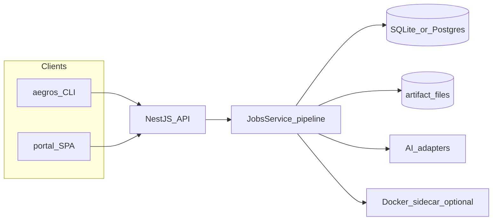

# Architecture

Documentation index: [README.md](./README.md) (usage vs development tracks).

## Monorepo packages

| Package                       | Role                                                                                                                    |
| ----------------------------- | ----------------------------------------------------------------------------------------------------------------------- |
| `@spearsystems/aegros-core`   | Domain normalization, pipeline DAG + `executePipeline`, engines (DNS, HTTP, tech, vuln hints), report v2, AI interfaces |
| `@spearsystems/aegros-server` | NestJS HTTP API (`/api`), Prisma persistence, optional Docker sidecar, AI adapters, webhooks, SARIF                     |
| `@spearsystems/aegros-portal` | Vite + React operator UI (`base: /portal/`)                                                                             |
| `@spearsystems/aegros-cli`    | `aegros` CLI (Commander + Ink watch UI) calling the API                                                                 |
| `@spearsystems/aegros`        | Published umbrella: bundles core, server, cli, portal dist for `npm i -g`                                               |

## Request flow (current)

## HTTP routes

- **API prefix:** `/api` (global).
- **Health:** `GET /api/health` (public; includes DB check).
- **Jobs:** `POST /api/v1/jobs`, `GET /api/v1/jobs`, `GET /api/v1/jobs/:id`, `GET /api/v1/jobs/:id/sarif`, `GET /api/v1/jobs/:id/events` (SSE).
- **Portal:** static + SPA fallback under `/portal/`

## Configuration

See [packages/aegros-server/.env.example](../packages/aegros-server/.env.example): `DATABASE_URL`, `AEGROS_ARTIFACTS_DIR`, `HOST`, `PORT`, `CORS_ORIGIN`, `RATE_LIMIT_PER_MIN`, `AEGROS_PORTAL_DIST`, `API_KEYS_REQUIRED`, `AEGROS_AI_PROVIDER`, `AEGROS_SCANNER_IMAGE`, budgets, and third-party AI keys.

## Decisions

- [ADR 0001 — storage & queue](./adr/0001-storage-queue.md)
